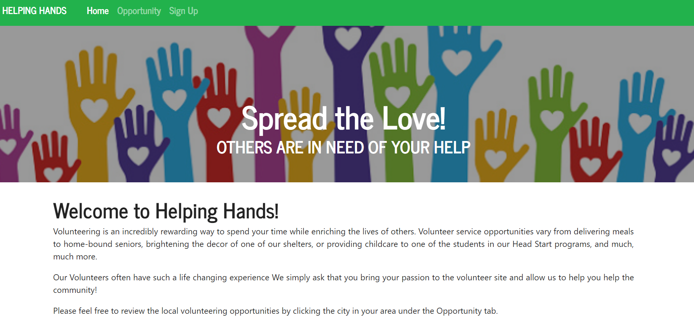

# Spread the Love!
## Helping Hands Volunteer App

## Overview
This application will help the user to find a volunteering opportunity.  The user will be able to select the service area of interest, the demographic group in need, and the general location.  On search, the application will provide a list of opportunities, who is hosting each one, and the link to the website advertising the opportunity.

## Description
This is a full-stack web application built with Node.js + Express.js + React.js.  The UI will take user provided criteria to help find a volunteering opportunity that interests them.  The user will be able to select the type of opportunity based on location.  The returned result will provide a list of opportunities and the link to the hosting website for each.

## Homepage

